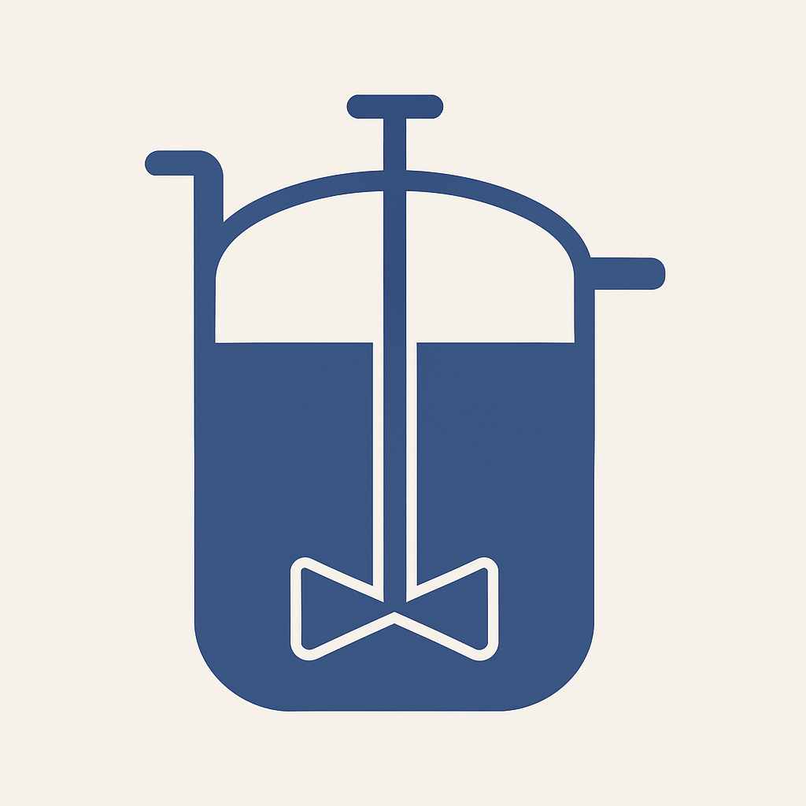

# Continuous Flow Reactor Simulator (CTSR)

This project was developed as part of the **Practical Programming in Chemistry (CHE-200)** course at EPFL.

**CTSR** is a flexible and modular simulator for continuous flow stirred tank reactors.  
It models one or more chemical reactions, including recycle streams, reversible and irreversible steps, and temperature effects.  
The tool helps analyze dynamic behavior and optimize key process variables to **maximize the selectivity** toward a desired product.